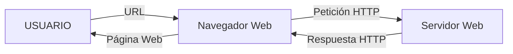
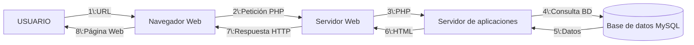
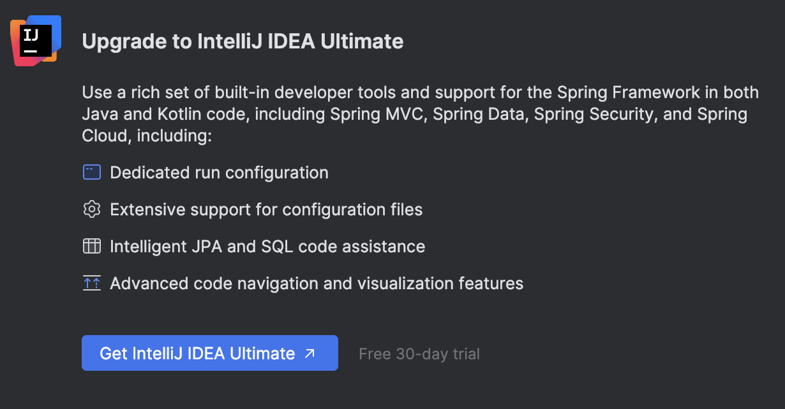
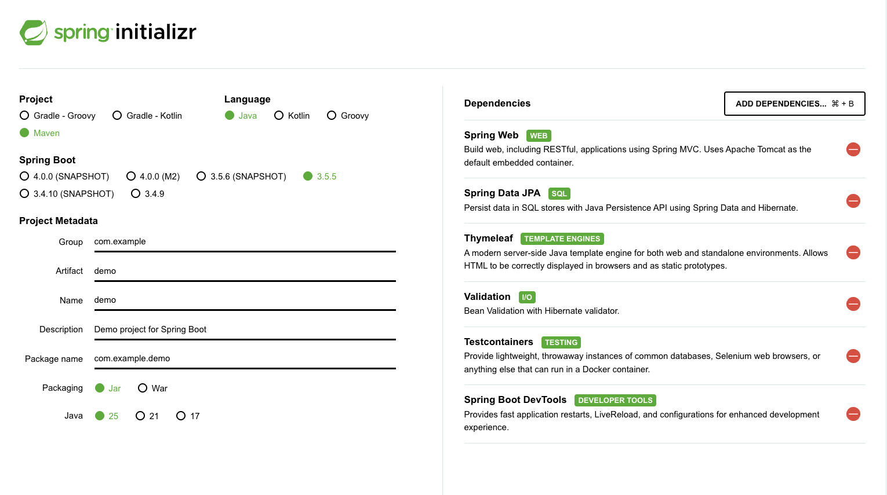
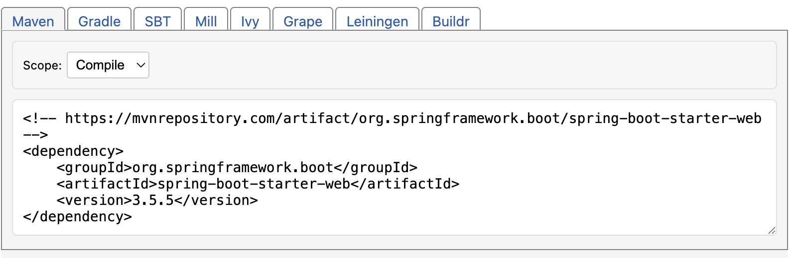
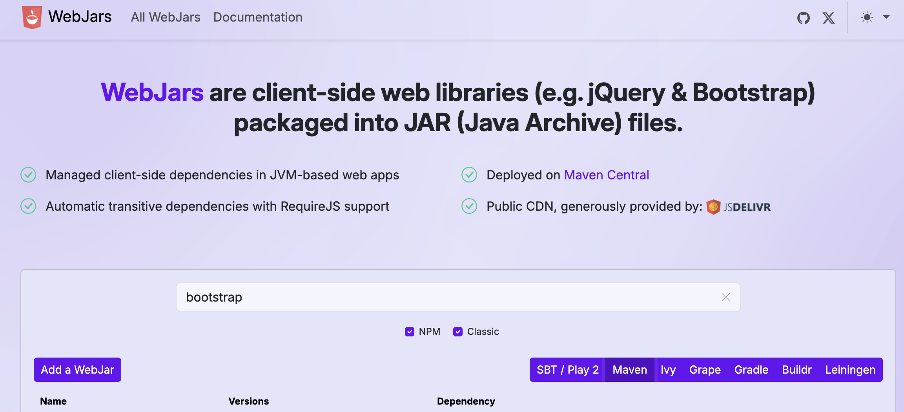
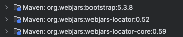

# Introduction to Web Applications

## How a Web Application Works

A web application is a computer program created using web technology that works through a browser or other devices. Web applications follow the so-called client-server model, where the client is a program or device that initiates a communication and the server responds to that request with the requested data.

One of the most popular web servers is [Apache HTTP Server Project](https://httpd.apache.org/) or httpd. The most widely used communication protocol is HTTP (on port 80), or its secure version HTTPS (on port 443).

The computer acting as the server listens for requests on these ports and responds with the data. In the case of a static web application, the server responds with the web page data, which is displayed in the client's browser. In the case of a dynamic application, the web page is generated on the server and sent to the client.

Below is a diagram showing the behavior of a static web page.



The page returned through a URL will always be the same in this case. On the other hand, for dynamic web pages:



As you can see, the process is more complex. The previous process is known as the AMP stack (Apache, MySQL, PHP). This is the model used by commercial packages such as XAMPP. However, this way of building web pages is becoming obsolete in favor of SPAs (Single Page Applications). In an SPA, the server does not build the page. Instead, it obtains the necessary data through the API (application programming interface) and passes it to the client application in JSON, XML, etc. format. The client application is then responsible for building the view. With this way of working, the Front End (client) and Back End (server) roles are clearly separated.

> **Activity**
>
> Create a diagram similar to the previous two, but for SPAs (it will look very similar to the dynamic web page diagram).

> **Activity**
>
> Create a comparison table between static pages, dynamic pages, and SPAs.

> **Activity**
>
> What type of web page would you use for the following cases, and why?

> * A website to promote an artistic profile
>
> * A website for checking today's weather
>
> * A personal blog
>
> * A website containing the documentation for an application
>
> * A website for selling cosmetics online

## Spring and Spring Boot

### The Spring Framework

[Spring](https://en.wikipedia.org/wiki/Spring_Framework) is currently the most widely used framework for creating applications in Java.

It has the following features:

* **Dependency Injection (DI):** a technique or design pattern used as one of the forms of Inversion of Control (IoC) to promote loose coupling. In other words, when a class needs another class (a dependency), instead of creating the object inside the class itself, Spring provides or injects it.

* **Modularity:** provides modularity, offering, among others, the following advantages:

  * Application scalability without needing to modify the classes.
  * Avoids dependencies between classes.
  * Simple development using POJOs (Plain Old Java Objects).
  * Minimizes *boilerplate* code (repetitive and simple code that only increases the number of lines of code).

* **Aspect-Oriented Programming (AOP):** allows much greater modularization, making it possible to clearly separate the different tasks that each class must perform in our application.

  * Simplifies data access through ORM (*Object Relational Mapping*).

* **Origin and purpose:** while J2EE was complex, slow, and resource-intensive, Spring was created as a simple and lightweight alternative.

* **Development with POJOs:** Spring allows simple development using POJOs (*Plain Old Java Objects*), which are simple objects or classes that do not need to inherit from other classes or implement complex interfaces.

With J2EE (*Java 2 Platform, Enterprise Edition*) applications before Spring, we had to create *Servlets*. A *Servlet* is an application that runs on a server and is prepared to respond to HTTP requests. Later, JSP (*Java Server Pages*) appeared, allowing HTML elements and XML configurations to be combined with fragments of Java code to generate dynamic content.

All of this meant that we had to start an application server separately and add the application to it in order to run and serve it as another web page. We can use *Servlets* to write a web application, but there are many intrinsic details that need to be handled: validation, REST, request/response bodies for JSON, form binding, etc. This means that a large part of our code is devoted to managing the lower communication layers.

With the Spring framework, we are still actually using *Servlets*, but it frees the programmer from this heavy task by managing it automatically. This allows the developer to focus on the application's logic without having to manage the lower levels of communication, as we will see later.

> **Notes taken from Joange's course**

### Spring Boot

Although Spring is a tool that makes Java application development easier, there was still considerable complexity involved in configuring a Spring project. This is why, in 2014, an extension of Spring called Spring Boot was developed with the purpose of simplifying the application creation process.

Basically, Spring Boot prepares a project for us using a series of conventions, taking care of all the configuration and also usually including an embedded web server (such as Tomcat). This is why Spring Boot is considered a Spring accelerator.

### Spring Stereotypes

* **`@Component`**

  Generic stereotype used to mark a class as a **Spring-managed component**. It is the base annotation that can be used when the class does not specifically fit into `@Service`, `@Controller`, or `@Repository`.

* **`@Controller`**

  Marks a class as a **Spring MVC controller**, which handles HTTP requests and returns responses (which can be views or JSON/XML when combined with `@ResponseBody`).

* **`@Service`**

  Indicates that a class represents the **business logic or services of the application**. It is a specialization of `@Component` intended to better organize the code.

* **`@Repository`**

  Marks a class as a **data access component (DAO)**. In addition, Spring automatically translates database-specific exceptions into generic Spring exceptions.

* **`@Bean`**

  Used inside a class annotated with `@Configuration` to **manually register a bean in the Spring container**.

### Spring Scopes

* **Singleton** (default)

  **A single instance** of the bean is created in the entire Spring container and shared among all dependencies that use it.

* **Prototype**

  Every time it is requested, Spring creates **a new instance** of the bean.

* **Request** (in web applications)

  **One instance is created for each HTTP request**.

* **Session** (in web applications)

  **One instance is created for each user session** and is maintained for the duration of the session.

> **NOTE:** Simple Java objects are known in the programming world as POJOs, which stands for Plain Old Java Object. It is an informal way of referring to simple Java objects.

## Setting Up a Spring Project

To work with Spring, a server-side web development framework that uses the Java language, we need Java, a package manager such as Maven, and an IDE. As an IDE, we can use any one that supports Java. A good option is Visual Studio Code with the appropriate extensions. We can also use NetBeans or Eclipse, which are open source, or even lighter editors such as [Zed](https://zed.dev/).

If we use an editor such as Zed (or even Visual Studio Code without the extensions), we have to use the command line and Maven commands to run a project. If we use Spring Boot, we simply need to go to the project root directory and run:

```bash
./mvnw spring-boot\:run
```

This always works and will be useful to keep in mind if we want to deploy our application in a **Docker** container in the future.

Finally, we also have the option of IntelliJ from JetBrains.

IntelliJ has two versions, one free and one paid (they used to be called Community Edition and Ultimate and were installed separately. This is no longer the case). The paid version can be accessed free of charge with a student license. To request a student license, you must go to the [student license application page](https://www.jetbrains.com/es-es/academy/student-pack/) and provide a document proving that you are studying a higher-level computer science course (enrollment documentation, student ID, etc.).

Both versions of IntelliJ can be used with Spring, but the Ultimate version has a number of quality-of-life advantages for developing applications.



> **RECOMMENDATION**
>
> When installing an IDE, it is important to disable text completion using machine learning to prevent Visual Studio Code or IntelliJ code suggestions from distracting us from what we actually want to write. Intellisense, on the other hand, is very useful. Intellisense is a tool that, when given a letter, suggests a series of elements related to our project (Java classes, variables, etc.). It comes by default in IntelliJ, while in VSC or Zed you have to install the extension for the specific language you want to use.
>
> The reason for disabling code completion is that it can distract us and make the thinking process more difficult. Code completion never gets our intention right 100%, and although it may seem helpful, it actually creates dependency and leads us down paths that are not always the best ones. It is better to invoke artificial intelligence when we need it rather than have it running all the time.

> **Activity**
>
> Install IntelliJ, Zed, and/or Visual Studio Code. Configure it to support Intellisense for the Java language and to prevent machine-learning code completion suggestions.

## Installing Java, Spring, and Maven

Java Development Kit (JDK) is the essential software for developing any type of application in Java: it includes the interpreter, Java classes, and Java development tools (JDT): compiler, debugger, documentation generator, etc. Its installation is essential for application development in any Java ecosystem. Some IDEs such as IntelliJ install it transparently for the user, but if we want to open `.jar` files or use Java outside IntelliJ, we need to install the JDK. The version we are going to use in this course is Java 25, which is the latest LTS version. To use Java 25, you need to have an up-to-date IDE.

> **Activity:**
>
> Install Java on your operating system. Use this [link to download it](https://www.oracle.com/es/java/technologies/downloads/#java25). For IntelliJ, Java is installed as part of the IDE. For other editors, you need to use this version.

> **Activity:**
>
> Install the [recommended packages](https://code.visualstudio.com/docs/languages/java) for using Java in Visual Studio Code.

> * The "Extension Pack for Java" extension. It includes language support, the Debugger, Test Runner, Maven, Gradle, the project manager, and Intellisense.
>
> * Also install the Spring Boot Extension Pack.

> **Activity**
>
> Configure the JDK. To do this, we can change the `JAVA_HOME` environment variable (although this has global scope) or, in VSC, go to the `settings.json` file and add the `java.jdt.java.home` variable with the path where we extracted our JDK. Remember that JSON uses the `"key" : "value"` combination and that each component must be separated by commas inside a `{}` section.

`settings.json`

```json
{
    "workbench.colorTheme": "Visual Studio Light",
    "java.jdt.ls.java.home": "C\\\Program Files\\\Java\\\jdk-25.0.0"
}
```

In addition to Java, the dependency manager we are going to use is Maven. **Maven** is a widely used project and dependency manager for Java projects. It defines the project structure and manages dependencies through an XML file called `pom.xml`. The advantages of using Maven are as follows:

* **Standardization:** It has a standard Java project structure, making collaboration between teams easier.

* **Dependency automation:** You can easily add dependencies, and Maven will automatically download the necessary libraries and their transitive dependencies from centralized repositories.

* **Continuous integration:** It is well supported by continuous integration (CI) tools such as Jenkins, GitLab CI, GitHub Actions, etc.

* **Popularity and support:** There is a huge community and a large amount of documentation available.

However, Maven also has some disadvantages:

* **XML:** Some developers consider editing `pom.xml` files tedious and difficult to read when the file becomes large.

* **Performance:** Compared with Gradle, Maven can be somewhat slower, especially in large projects.

**Maven** is an excellent option for working on **medium-sized or large projects**. It is also ideal for projects with distributed teams, since its standard structure and widespread use in the industry make it easy to adopt.

### Setting Up a Project with Maven

1. **Create a project with Maven:**

   * When creating a new project in IntelliJ, select **Maven** as the project option.

   * IntelliJ will automatically generate a `pom.xml` file where you can add your dependencies.

2. **Add dependencies in Maven:**

   * Open the `pom.xml` file and add the dependencies inside the `<dependencies>` section:

```xml
<dependencies>
    <dependency>
        <groupId>junit</groupId>
        <artifactId>junit</artifactId>
        <version>4.13.1</version>
        <scope>test</scope>
    </dependency>
</dependencies>
```

3. **Run Maven:**

   * You can run Maven commands directly in IntelliJ from the Maven panel on the right sidebar.

   * Common commands include `clean`, `install`, and `package`.

> **Activity**
>
> Create a Java project using Maven and a program that, when executed, prints `"Hello World, I live in Maven"` to the console.

### Git and GitHub

Finally, it is advisable to configure both IntelliJ and VSC to support GIT. This allows us to have version control for our project and, if we link it to our GITHUB account, we can also have a backup in the cloud.

## Spring Projects

We can create a Spring project in three ways. The first is through the VSC initializer or IntelliJ Ultimate. The second is through [start.spring.io](https://start.spring.io/), which is a form where we can generate an empty project with whatever configuration we want. The third is to copy an existing project and modify it.



In this image, we can see an example of how to use the Spring initializer. When we click generate, it will create a project, which we then need to open in our IDE.

In this case, we choose the project manager (Maven), the language (Java), the Spring Boot version (3.5.5), and the project metadata.

* Group: It follows a reverse-domain format. In this case, we define the project's domain.

* Artifact: The name of the artifact. Artifacts are files produced by a BUILD process, that is, the `.jar` or `.war` files resulting from building the project.

* Name: The name of the project.

* Description: A description of the project.

* Package name: It follows a reverse-domain format. It is the main package of the project.

* Packaging: Whether we want a `.jar` or a `.war`. The `.war` is intended to be launched on an application server, while the `.jar` has the server integrated. For now, we choose `.jar`.

* Java: The Java version. The latest LTS (Long Term Support) versions are available. We choose version 25 because it is the most recent.

On the other hand, on the right we can see the dependencies. We have added the dependencies `Spring Web`, `Spring Data JPA`, `Thymeleaf`, `Validation`, `TestContainers`, and `Spring Boot DevTools`. Dependencies can be added manually from the `pom.xml` file generated by Maven. In it, we go to the `<dependencies>` section and add the `<dependency>`.

The generated `pom.xml` file is as follows:

```xml
<?xml version="1.0" encoding="UTF-8"?>
<project xmlns="http://maven.apache.org/POM/4.0.0" xmlns:xsi="http://www.w3.org/2001/XMLSchema-instance"
    xsi:schemaLocation="http://maven.apache.org/POM/4.0.0 https://maven.apache.org/xsd/maven-4.0.0.xsd">

    <modelVersion>4.0.0</modelVersion>

    <parent>
        <groupId>org.springframework.boot</groupId>
        <artifactId>spring-boot-starter-parent</artifactId>
        <version>3.5.5</version>
        <relativePath/> <!-- lookup parent from repository -->
    </parent>

    <groupId>com.example</groupId>
    <artifactId>demo</artifactId>
    <version>0.0.1-SNAPSHOT</version>
    <name>demo</name>
    <description>Demo project for Spring Boot</description>
    <url/>

    <licenses>
        <license/>
    </licenses>

    <developers>
        <developer/>
    </developers>

    <scm>
        <connection/>
        <developerConnection/>
        <tag/>
        <url/>
    </scm>

    <properties>
        <java.version>25</java.version>
    </properties>

    <dependencies>
        <dependency>
            <groupId>org.springframework.boot</groupId>
            <artifactId>spring-boot-starter-data-jpa</artifactId>
        </dependency>

        <dependency>
            <groupId>org.springframework.boot</groupId>
            <artifactId>spring-boot-starter-thymeleaf</artifactId>
        </dependency>

        <dependency>
            <groupId>org.springframework.boot</groupId>
            <artifactId>spring-boot-starter-validation</artifactId>
        </dependency>

        <dependency>
            <groupId>org.springframework.boot</groupId>
            <artifactId>spring-boot-starter-web</artifactId>
        </dependency>

        <dependency>
            <groupId>org.springframework.boot</groupId>
            <artifactId>spring-boot-devtools</artifactId>
            <scope>runtime</scope>
            <optional>true</optional>
        </dependency>

        <dependency>
            <groupId>org.springframework.boot</groupId>
            <artifactId>spring-boot-starter-test</artifactId>
            <scope>test</scope>
        </dependency>

        <dependency>
            <groupId>org.springframework.boot</groupId>
            <artifactId>spring-boot-testcontainers</artifactId>
            <scope>test</scope>
        </dependency>

        <dependency>
            <groupId>org.testcontainers</groupId>
            <artifactId>junit-jupiter</artifactId>
            <scope>test</scope>
        </dependency>
    </dependencies>

    <build>
        <plugins>
            <plugin>
                <groupId>org.springframework.boot</groupId>
                <artifactId>spring-boot-maven-plugin</artifactId>
            </plugin>
        </plugins>
    </build>

</project>
```

We can add or remove dependencies, as well as modify any part of the `pom` file as we go, but after each change we have to reload the project for the changes to take effect.

On the [mvnrepository.com](https://mvnrepository.com/) website, all Maven repositories that can be added to your `pom.xml` are available. Official Spring dependencies start with `"spring-boot-starter-"` and the most common ones are:

* web
* data-jpa
* validation
* test

We search for the dependency using the search engine and click on it. Once inside, we select the version of our Spring Boot installation, and the text that we need to copy into our `pom.xml` file will appear.



## Static Content

In Spring Boot, the static content of our web application is stored in the *`src/main/resources/static`* folder. HTML files, CSS files, images, etc. are stored here. If we put an `index.html` file in this folder, the application will start directly using that document.

> **Activity:**
>
> Create a Spring project with Spring Boot (either using the IDE initializer or the web page provided above) with the Spring Web extension and run it. The following will appear in the terminal window:

```text
  .   ____          _            __ _ _
 /\\ / ___'_ __ _ _(_)_ __  __ _ \ \ \ \
( ( )\___ | '_ | '_| | '_ \/ _` | \ \ \ \
 \\/  ___)| |_)| | | | | || (_| |  ) ) ) )
  '  |____| .__|_| |_|_| |_\__, | / / / /
 =========|_|==============|___/=/_/_/_/

 :: Spring Boot ::                (v3.5.5)

2025-09-17T10:48:55.412+02:00  INFO 35927 --- [demo2] [           main] com.example.demo2.Demo2Application       : Starting Demo2Application using Java 25 with PID 35927 (/Users/arturoalbero/Desktop/demo2/target/classes started by arturoalbero in /Users/arturoalbero/Desktop/demo2)

2025-09-17T10:48:55.414+02:00  INFO 35927 --- [demo2] [           main] com.example.demo2.Demo2Application       : No active profile set, falling back to 1 default profile: "default"

2025-09-17T10:48:55.826+02:00  INFO 35927 --- [demo2] [           main] o.s.b.w.embedded.tomcat.TomcatWebServer  : Tomcat initialized with port 8080 (http)

2025-09-17T10:48:55.834+02:00  INFO 35927 --- [demo2] [           main] o.apache.catalina.core.StandardService   : Starting service [Tomcat]

2025-09-17T10:48:55.834+02:00  INFO 35927 --- [demo2] [           main] o.apache.catalina.core.StandardEngine    : Starting Servlet engine: [Apache Tomcat/10.1.44]

2025-09-17T10:48:55.857+02:00  INFO 35927 --- [demo2] [           main] o.a.c.c.C.[Tomcat].[localhost].[/]       : Initializing Spring embedded WebApplicationContext

2025-09-17T10:48:55.858+02:00  INFO 35927 --- [demo2] [           main] w.s.c.ServletWebServerApplicationContext : Root WebApplicationContext: initialization completed in 407 ms

2025-09-17T10:48:56.000+02:00  WARN 35927 --- [demo2] [           main] ion$DefaultTemplateResolverConfiguration : Cannot find template location: classpath:/templates/ (please add some templates, check your Thymeleaf configuration, or set spring.thymeleaf.check-template-location=false)

2025-09-17T10:48:56.036+02:00  INFO 35927 --- [demo2] [           main] o.s.b.w.embedded.tomcat.TomcatWebServer  : Tomcat started on port 8080 with context path '/'

2025-09-17T10:48:56.042+02:00  INFO 35927 --- [demo2] [           main] com.example.demo2.Demo2Application       : Started Demo2Application in 0.902 seconds (process running for 1.103)
```

If we look closely, the TomcatWebServer has started on port 8080. To access our application, go to `localhost:8080` in your browser. The following will appear:

```text
Whitelabel Error Page

This application has no explicit mapping for /error, so you are seeing this as a fallback.

Wed Sep 17 10:50:54 CEST 2025

There was an unexpected error (type=Not Found, status=404).
```

> Now, close the project and create an `index.html` file in the `/static` folder.

```html
<!DOCTYPE html>
<html lang="en">
<head>
    <meta charset="UTF-8">
    <title>Title</title>
</head>
<body>
    <p>Hello World</p>
</body>
</html>
```

> Run the project again and return to the localhost page. Your web page will appear.

## WebJars

JQuery, Bootstrap, and other libraries are static resources that are frequently used. In many cases, the way to incorporate them into our projects is by including the original library URLs ([CDN, from Cloudflare](https://www.cloudflare.com/es-es/learning/cdn/what-is-a-cdn/)) or by downloading them to our server and using local URLs.

Both cases have disadvantages. In the first case, you depend on CDN servers and also have to download the libraries every time you want to use them (which makes the application slower). In the second case, we have to download the files and manage the versions.

Spring offers a third option, **WebJars**. A WebJar allows us to work with static resources as if they were Maven dependencies. This gives us the advantage of downloading them to our server while also having the version controlled automatically. Everything is managed through Maven, making the process transparent to the developer. A WebJar is simply another dependency. We can access WebJars through [webjars.org](https://www.webjars.org/).



On the website, we can choose the dependency format. We select Maven and search for one that interests us, for example Bootstrap 5. We will also need the [webjars-locator](https://mvnrepository.com/artifact/org.webjars/webjars-locator) dependency from the official Maven repository. We copy the text into the dependencies section of our `pom.xml` and reload the project (in IntelliJ, right-click the `pom.xml` file and select Maven → Sync Project).

```xml
<dependency>
    <groupId>org.webjars</groupId>
    <artifactId>webjars-locator</artifactId>
    <version>0.52</version>
</dependency>

<dependency>
    <groupId>org.webjars</groupId>
    <artifactId>bootstrap</artifactId>
    <version>5.3.8</version>
</dependency>
```

Finally, we modify the HTML we created earlier as follows so that it includes the installed libraries, and then run the project to see the results:

```html
<!DOCTYPE html>
<html lang="en">
<head>
    <meta charset="UTF-8">
    <title>Title</title>
    <link href="/webjars/bootstrap/css/bootstrap.min.css" rel="stylesheet">
    <script src="/webjars/bootstrap/js/bootstrap.bundle.min.js">
    </script>
</head>
<body>
    <p>Hello World</p>
</body>
</html>
```

Notice that the packages installed as dependencies can be found in the `External Libraries` folder:



## Changing the Application Port

The default port for a Spring Boot application is 8080, but it can be changed in several ways. The most common method is to modify the `application.properties` file in `src/main/resources` and add the line `server.port=9090`, where the number indicates the port (in this case, 9090) on which our application will run.

Changing the port can be useful to avoid collisions between services that use the same ports, or if we want to have several Spring Boot applications running at the same time.

> **ACTIVITY:**
>
> Change the application port to 12345.

> **RECOMMENDED COURSE SETUP**
>
> * Use IntelliJ as your IDE. The free version is sufficient. With this setup, you will not need to install Java on your computer.
>
> * Use Spring Boot Initializr to generate the starting projects. Then simply open the project with IntelliJ.

> **ACTIVITY**
>
> Create a static web page about Frédéric Chopin. Create the project using https://start.spring.io with the following characteristics:

> * Include the Spring Web, Starter Thymeleaf, and DevTools dependencies.
>
> * Use `.jar` packaging and Java 21.
>
> * Configure it to listen on port 9001.
>
> `index.html` with a general biography (you can extract information from Wikipedia and summarize it). Include information about his birth and death, as well as the places where he carried out his professional activities. Talk about his wife George Sand and his time in Mallorca, as well as any other information you consider important or interesting.

> `repertorio.html` with a list of the composer's most relevant pieces. Add links to the selected scores available on imslp.org, as well as videos of performances on YouTube or on IMSLP for each one.

> `galeria-imagenes.html` with relevant photographs and paintings. You can extract them from Wikipedia.

> `enlaces-externos.html` with relevant links for the website. You can add links to his Wikipedia page and imslp.org, as well as to an article you find online.

> The content of the website can be in Spanish, although you can use a chatbot or a translator to translate it into English.
