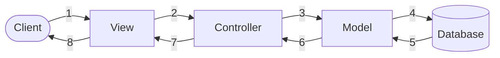
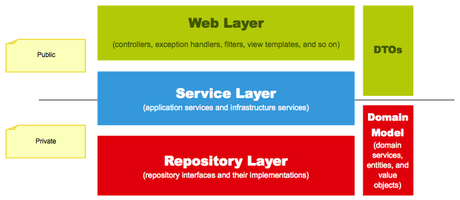

# Web Applications in Spring

## Model-View-Controller

The **Model-View-Controller (MVC)** design pattern is a programming architecture that separates an application into three main components: **Model**, **View**, and **Controller**. Each of these parts is responsible for a different task.

Applied to web servers:

* The **Model** represents the data and business logic.

* The **View** is the visual representation of the data (for example, a web page).

* The **Controller** manages user interactions, processes requests, and updates the Model and View as appropriate.

### Model

This is the part of the application responsible for managing data. The Model is responsible for retrieving, processing, and storing information, as well as applying business rules.

In the context of a web application, the Model can include classes representing domain entities, as well as services that manage business logic.

In our case, we will use an ORM (**Hibernate**) to manage data persistence, so the Model will consist of entity classes and repositories that manage access to the database.

### View

Depending on the type of server we are creating, the View may or may not exist.

#### View Generated by the Controller

If we are developing a complete web application, the View will be the web page dynamically generated from client requests. To generate these pages, templates are used, which allow HTML code to be combined with data coming from the Model.

The combination of these two elements produces the dynamic web page that is returned to the client.

In Spring, the **Thymeleaf** template engine is commonly used to generate dynamic web pages.

You can find more information at:

https://www.thymeleaf.org

#### No Views (i.e. Generated by the Client)

Sometimes we do not need to generate a web page, but simply want to return data to the client. In these cases, we are talking about REST APIs, where the View is nothing more than a set of data in JSON or XML format. In these cases, there is a conversion engine between Java objects and JSON, such as Jackson, which converts the Model data into JSON format so that it can be returned to the client in an HTTP message.

In this way, the client side (frontend) is completely separated from the server side (backend), allowing a single server to provide data to multiple clients.

## 1.3. Controller

The Controller is the part of the application responsible for managing user interactions. It receives requests from the client, processes the information, and decides what action to take.

The great advantage of Spring compared with old Servlets is that the Controller does not handle requests at a low level, analyze client requests (*request*), or generate responses (*response*).

We simply define the requests that we want to handle, and the framework takes care of the entire management process, from receiving the request to sending the response.

This allows us to focus on business logic and data management without worrying about handling requests and responses at a low level.

# 2. Request Flow

Graphically, the flow of a request through the MVC pattern would be as follows:



Client and View could be grouped together as the same thing. Here, we understand the client as the physical actor (for example, a person) and the View as the logical part (the web page consulted by that person).

### Request Flow

The user uses the client application (normally a browser or a client application) and makes a request using the HTTP protocol, also known as **HTTP_REQUEST**.

These requests are received by the **Controller**, which manages the list of operations or events that it can process, as defined by its own code.

Usually, the Controller cannot provide the information by itself, so it needs to retrieve or modify data. To do this, it sends the parameters received in the request to the Model.

This layer accesses the data by performing operations on the database management system (DBMS). The work of the Model can be divided into two steps:

1. Query the database.
2. Retrieve the query results.

Once the data has been obtained, the **Model** transfers the set of results to the **View**.

The **View** is responsible for receiving the data and presenting or formatting it appropriately, depending on the type of application:

* Web application → HTML.
* REST API → JSON.

Finally, the **Controller** returns the representation generated by the View to the client application through an **HTTP_RESPONSE**.

## Layered Model

**Spring** works in a very robust way using a series of layers. The first reference we can use is the OSI network model.

> **Informal definition of a layer**
>
> A layer (within a stack of layers) is defined as a set of tools. In computer science, these tools are functions and/or methods. These tools:
>
> * Are used by the layer above to perform its task.
> * To implement them, a layer uses the tools provided by the layer below.

Therefore, the first thing we will do is define the layers of our application structure. Spring provides a layered structure such as the following:

### Spring Layer Structure



From the previous figure, we can extract the following information (from bottom to top):

#### Private Layer (in red): Repository Layer

This layer has the data model definition underneath it:

* The data model will consist of our mapped classes.
* The repository will interact with the database.
* No object from this layer is exposed externally.

#### Intermediate Layer (in blue): Service Layer

It encapsulates the business logic. This is what is known as a service:

* It is responsible for making calls to the repository to retrieve data from the model.
* It is responsible for transforming Model data into DTOs and vice versa. DTO (*Data Transfer Objects*) classes are simple information containers.

#### Public or Exposed Layer (in green): Web Layer

* The web layer consists of controllers and templates (if any).
* It handles DTO classes.
* It is in contact with client applications.

The idea is to create a package structure that groups the classes into six main packages:

* Package containing the main class.
* Web layer containing the controllers.
* Data access layer containing the repository.
* Service layer.
* Data model layer.
* DTO layer.

The objective is that, through a well-defined architecture coupled through dependency injection, communication and access between the different layers are facilitated.

### Layer = Package

By convention, we will create a package for each layer.

* In each package, we will create all the classes corresponding to that layer.
* All packages will be contained within the main package.
* Remember that, since all packages are inside *main*, Spring Boot's `@ComponentScan` annotation, which by default scans the package containing the main class and all its subpackages, will allow us to access all the classes in the different layers.

## 2.1. Main Class

Every Java application must contain a main class with a `main` method. When implementing an application with Spring, this method must call the `run` method of the `SpringApplication` class.

We will leave this class in the root by default, so that we will always find it in the same location.

Next, we will define the application structure by implementing the remaining classes.

## 2.2. Web Layer. Controller Layer

We will start with the highest-level layer, the controller layer, where we will expose the application's services. In our application, it will be called `controller`.

This will be studied in Unit 6; for now, we will only create the package.

## 2.3. Service Layer

This is the layer responsible for implementing the business logic, that is, all the tasks that our system is capable of performing. It represents the implementation of what the controller provides.

This is one of the most important layers, since all data validation operations related to business logic (for example, checking that a bank account has sufficient funds when making a payment) and security will be carried out here. It will be called `service`.

Normally, services access data stored in the database through repositories, perform a series of operations, and return the results to the controller.

This will be covered in Unit 5; for now, we will only create the package.

## 2.4. Repository Layer

Repositories are the classes responsible for managing data access. They normally contain CRUD operations using a single entity class from the domain model. This layer will be called `repository`.

They can also contain operations related to two different models.

## 2.5. Model Layer

It will contain mappings of database tables to classes representing entities. This layer will be called `model`.

## 2.6. DTO Layer

Controllers normally manage DTOs instead of POJOs (*Plain Old Java Objects*) or *beans*, due to the API structure or the representation used in the Views.

Therefore, it will be necessary to implement a bidirectional conversion between a POJO and a DTO model.

> **ACTIVITY**
>
> Create a base project that has one package for each layer. It can serve as a template for future projects.

---

## Introduction to Controllers

Although we will not study controllers until later, it is useful to know what they are and how they work so that we can use them to perform simple tests.

A controller is a Java class, annotated with `@Controller`, which is used to communicate between the server and the client.

Let's look at a simple controller.

If we do this:

```java
@Controller
public class MyController {

    @GetMapping("/")
    public String index(){

        return "HolaMundo";
    }

}
```

The first thing we have to do is mark the class as a controller using the `@Controller` annotation (the class should not be called Controller, otherwise an import error will occur).

Then we have to map the endpoints, which are basically the browser addresses. In this case, if we have the application configured to run on port 8080 (which is where Spring Boot runs by default), we use the `@GetMapping("/")` annotation to map HTTP GET messages (which are the default messages). Inside the parentheses, we specify the endpoints, in this case `/`. Therefore, if we connect to `http://localhost:8080/`, we will see the content returned by the controller method.

However, the String returned by the controller is actually a View stored in `resources`. In this case, it will attempt to resolve it using a ViewResolver (such as Thymeleaf), but since we do not have one configured, it will produce a `whitelabel error`.

To allow it to return plain text, we must wrap the controller method in another annotation, `@ResponseBody`.

```java
@Controller
public class MyController {

    @GetMapping("/")
    @ResponseBody
    public String index(){

        return "Hola Mundo";
    }

}
```

Alternatively, we can also use `@RestController`, which already includes `@ResponseBody` in its definition:

```java
@RestController
public class MyController {

    @GetMapping("/")
    public String index(){

        return "Hola Mundo";
    }

}
```

In this way, knowing that these controllers allow us to render character strings in the browser, we can use them (in addition to logs, which we will see later) to test our upcoming work with the domain model, repositories, services, and DTOs.

In Unit 6, we will study controllers in greater depth, both those focused on Views (using `@Controller`) and those focused on APIs (using `@RestController`). We will see how to work with parameters and how to handle exceptions that may arise.

> **ACTIVITY:**
>
> Create a controller with the following methods:
>
> * An `index()` method mapped to the `/` endpoint that says `"This is the index"`.
>
> * An `about()` method mapped to the `/about` endpoint that says `"About us"`.
>
> Create two versions of the controller, one using `@RestController` and another using `@Controller` and `@ResponseBody`.

Yes. Let's explain it **without going into varargs**, as if the method simply received a normal array.

## Interface `CommandLineRunner`

`CommandLineRunner` is a Spring Boot interface that allows code to be executed **immediately after the application has finished starting**.

Its method is:

```java
void run(String[] args);
```

It can also be written using `...` instead of `[]`, which indicates that it can receive one or more String objects. These arguments are the same ones received by `main`, so they only make sense if we run Spring from the command line.

This is its original use, but it is also used for the following tasks:

* Insert initial data into the database.
* Check connections (databases, APIs).
* Execute configuration tasks.
* Launch batch processes at startup.

To execute it, we create a Spring component anywhere in the application as follows:

```java
@Component
public class MyRunner implements CommandLineRunner {

    @Override
    public void run(String[] args) {

        System.out.println("Application started");
    }

}
```

In this case, the output at startup would be:

```text
Application started
```

Broadly speaking, it performs the same function that we assigned to our `main` methods in conventional Java. Therefore, we can do the following:

```java
@Component
public class MyRunner implements CommandLineRunner {

    @Override
    public void run(String[] args) {

        Scanner scanner = new Scanner(System.in);

        System.out.print("Enter your name: ");

        String name = scanner.nextLine();

        System.out.println("Hello " + name);
    }

}
```

Logically, **it is a bad idea for our web application to wait for someone to enter data in the terminal**, but this use can be helpful for performing tests until we work in depth with controllers.

> **ACTIVITY**
>
> Create a `CommandLineRunner` that asks the user for two numbers through the terminal. You can convert character strings to integers when using a `Scanner` object (`sc`) with `Integer.parseInt(sc.nextLine())`. At the same time, create a controller with the following methods:
>
> * A **`suma()` method** mapped to the `/suma` endpoint that returns the result of the addition in the browser.
>
> * A **`resta()` method** mapped to the `/resta` endpoint that returns the result of the subtraction in the browser.
>
> * A **`mult()` method** mapped to the `/mult` endpoint that returns the result of the multiplication in the browser.
>
> * A **`div()` method** mapped to the `/div` endpoint that returns the result of the division in the browser. If division by zero occurs, it should display a warning through an exception. Wrap the operation in a try-catch block. Obtain the result with decimals and accurately.
>
> To send the data from the `CommandLineRunner` to the controller, you can use static variables.
